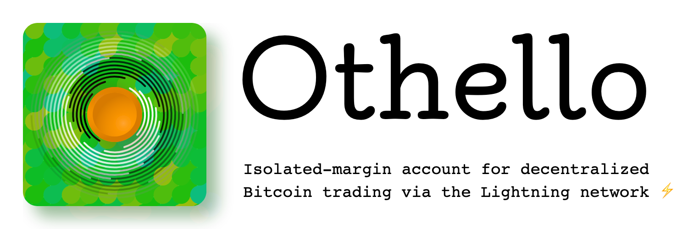

# Othello

[](https://twentyone.world)
[](https://mempool.space/lightning)
[](https://npmjs.com/package/@krutt/othello)
[](https://github.com/dannydeezy/tao-wallet)
[](LICENSE)



# Usage

## Install as dependency

```sh
$ npm install @krutt/othello
# OR
$ yarn add @krutt/othello
```

## Usage

```typescript
// imports
import { Othello } from '@krutt/othello'
import { randomBytes } from 'node:crypto'

// On first usage, generate a secret for the backend LnMarkets account.
let lnmSecret: string = randomBytes(16).toString('hex')
let network: string = 'mainnet'
let othello: Othello = new Othello({ lnmSecret, network })

// Login.
await othello.login()

// Create an invoice to deposit funds (amount in sats).
let depositInvoice = await othello.fetchDepositAddress({ amountSats: 1000000, type: 'bolt11' })
console.log(depositInvoice)

// Create an on-chain address to deposit funds.
let depositAddress: string = await othello.fetchDepositAddress({ type: 'on-chain' })
console.log(depositAddress)

// Get balances.
let balances = await othello.fetchBalances()
console.log(balances)

// Swap btc for $2 of usd.
await othello.swap({ from: 'btc', to: 'usd', amountUsd: 2 })

// Swap $1 of usd for btc.
await othello.swap({ from: 'usd', to: 'btc', amountUsd: 1 })

// Send funds from your othello wallet to a lightning invoice.
let invoice: string = 'lnbc1....'
await othello.send({ type: 'bolt11', address: invoice })

// Send 100,000 sats from your othello wallet to an on-chain address.
let onchainAddress: string = 'bc1...'
await othello.send({
  type: 'on-chain',
  address: onchainAddress,
  amountSats: 100000,
})
```

### Examples

```sh
# First you may install tsx command using the following command `npm install -g tsx`
$ tsx example/credentials.ts
>
```

> **Degen:** "But they're tracking me..."
> **Othello:** "No they're not, but try this"

```sh
$ tsx example/incognito.ts
>
```

## License

This project is licensed under the terms of the MIT license.
